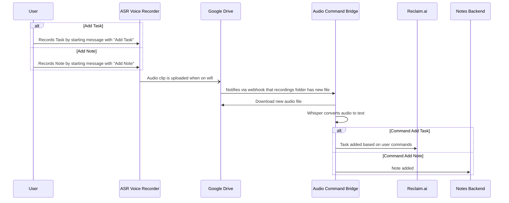

## User Onboarding

## User Flow

```mermaid
sequenceDiagram
	participant U as User
	participant A as ASR Voice Recorder
	participant G as Google Drive
	participant B as Audio Command Bridge
	participant R as Reclaim.ai
	participant N as Notes Backend

	alt Add Task
		U ->> A: Records Task by starting message with "Add Task"
	else Add Note
		U ->> A: Records Note by starting message with "Add Note"
	end

	A -) G: Audio clip is uploaded when on wifi
	G ->> B: Notifies via webhook that recordings folder has new file
	B ->> G: Download new audio file
	B ->> B: Whisper converts audio to text

	alt Command Add Task
		B ->> R: Task added based on user commands
	else Command Add Note
		B ->> N: Note added
	end
```
