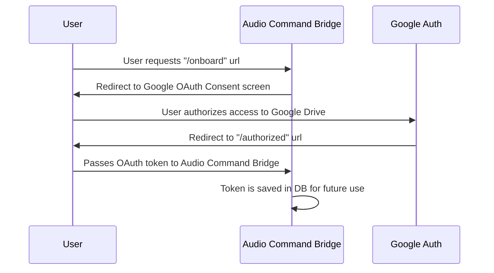
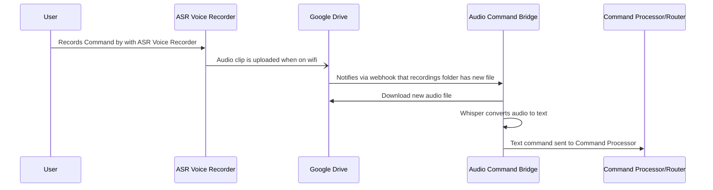

## User Onboarding

```mermaid
sequenceDiagram
	participant U as User
	participant B as Audio Command Bridge
	participant G as Google Auth

	U ->> B: User requests "/onboard" url
	B ->> U: Redirect to Google OAuth Consent screen
	U ->> G: User authorizes access to Google Drive
	G ->> U: Redirect to "/authorized" url
	U ->> B: Passes OAuth token to Audio Command Bridge
	B ->> B: Token is saved in DB for future use
```

## User Flow

```mermaid
sequenceDiagram
	participant U as User
	participant A as ASR Voice Recorder
	participant G as Google Drive
	participant B as Audio Command Bridge
	participant C as Command Processor/Router


	U ->> A: Records Command by with ASR Voice Recorder
	A -) G: Audio clip is uploaded when on wifi
	G ->> B: Notifies via webhook that recordings folder has new file
	B ->> G: Download new audio file
	B ->> B: Whisper converts audio to text
	B ->> C: Text command sent to Command Processor
```
